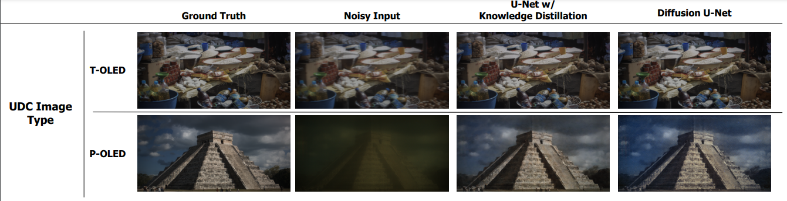

# Clicking Better Images with Under Display Cameras (UDC) in Smartphones
### Umar Masud, Faraz Ali <br> <small>CSC2529H Computational Imaging 2023, University of Toronto

## Abstract: 
Under Display Cameras (UDC) are an emerging technology particularly developed for smartphones where the camera is embedded
under the display so that the screen covers the entire surface. However, placing the camera inside the screen introduces degradations such as noise, flare, haze and low light. In this work, we solve this ill-posed inverse problem and restore the UDC image, through approaches of cross-model knowledge distillation and denoising diffusion probabilistic models. Distillation allows us to develop an efficient solution which is deployable, meanwhile, the use of diffusion models previously unexplored on UDC gives some interesting results, beating the state-of-the-art PSNR value.

[](./CSC2529_Project_Poster_Umar_Faraz.pdf)
[](./CSC2529H_Final_Project_Report_2023.pdf)

## Results
The degradation through UDC can be seen as:


The output resuls of our methods:


## Getting Started
Our code is tested in Python 3.10.12 + CUDA 12.2
1. Fork and Clone the repository.
2. Create and activate a virtual environment:<br>
```
python3 -m venv ./ENV_NAME
```
3. Install libraries using pip:<br>
```
pip install -r requirements.txt
```


## Dataset
Download the dataset provided on this [LINK](https://yzhouas.github.io/projects/UDC/udc.html). Place the dataset in a directory and change the paths in `/src/dataset.py` to use the images. The dataset contains two categories: T-OLED and P-OLED, each having 240 pair of clean/noisy images for training and 30 for test/val.<br>
Note: The test/val images are in matlab format so first change it to a png format.

## Training and Evaluation
### Train
To train a model, run the following script:<br>
```
cd ./src/ && python3 train.py
```

In the main function of `train.py`, you will find various training parameters than can be adjusted based on what models you want to train. For example, the `EXPERIMENT` variable controls whether a Knowledge Distillation or Diffusion experiment is run. 

There is also a `MODEL_CONFIG` variable in `train.py` that further specifies hyperparameters to use for the diffusion models.

To train the standard diffusion model, make sure to download the pretrained FFHQ weights from [here](https://drive.google.com/file/d/1BGwhRWUoguF-D8wlZ65tf227gp3cDUDh/view?usp=share_link), and then place inside the `models/` directory.

### Test 
Run the following script to evaluate a trained model:<br>
```
cd ./src/ && python3 evaluate.py
```
NOTE: Remember to change which models to train and save in `def train()` function in `src/train.py` and give the right path to saved model in `src/evaluate.py`.

## Citation
If you found our work useful then please cite it as:<br>
```
Masud, U., & Ali, F. (2023). Clicking Better Images with Under Display Cameras (UDC) in Smartphones.
```
